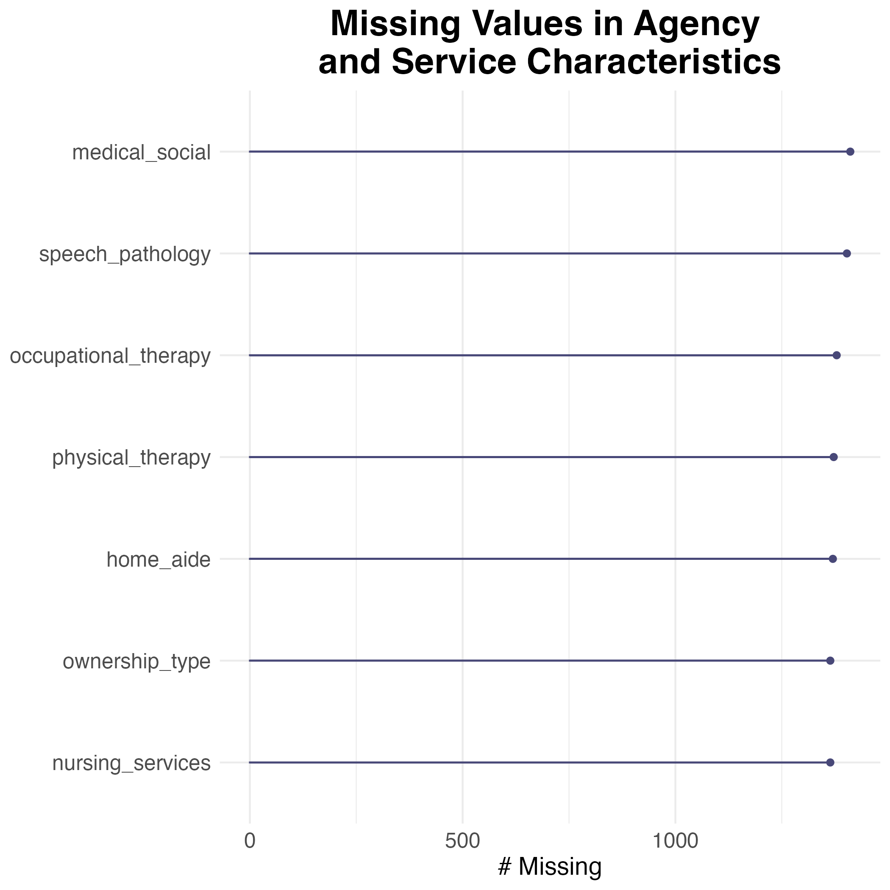
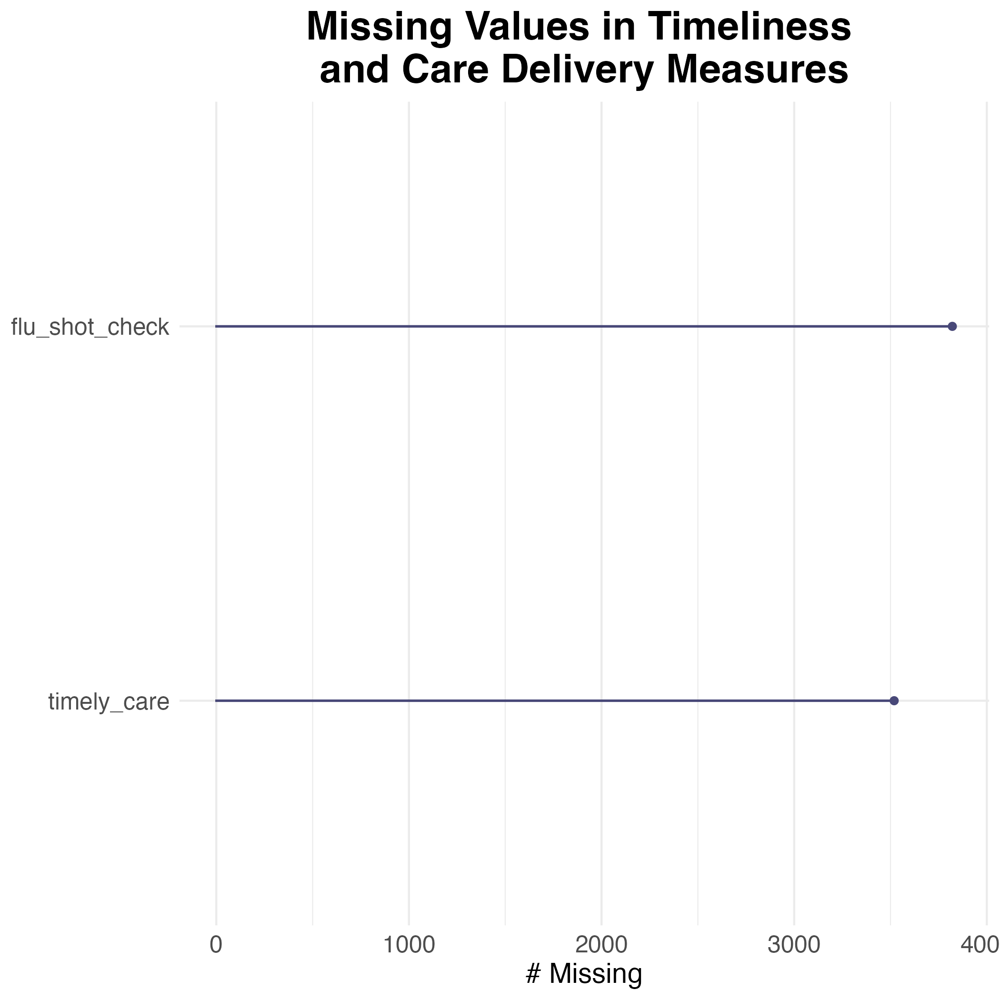
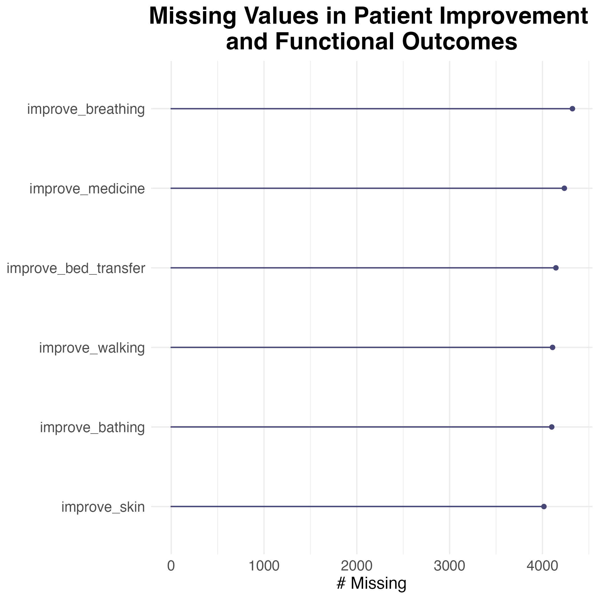
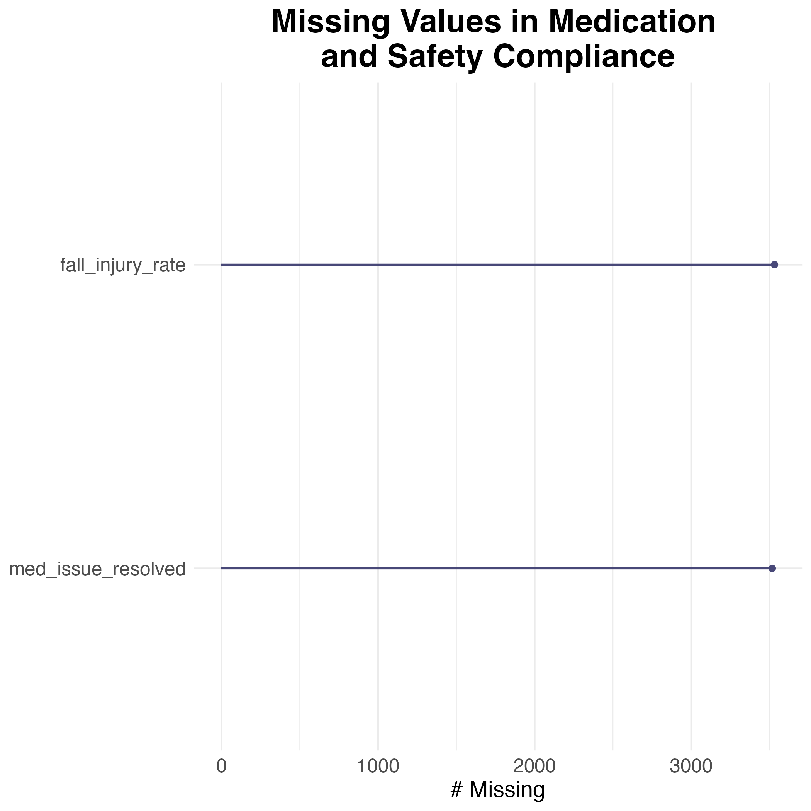
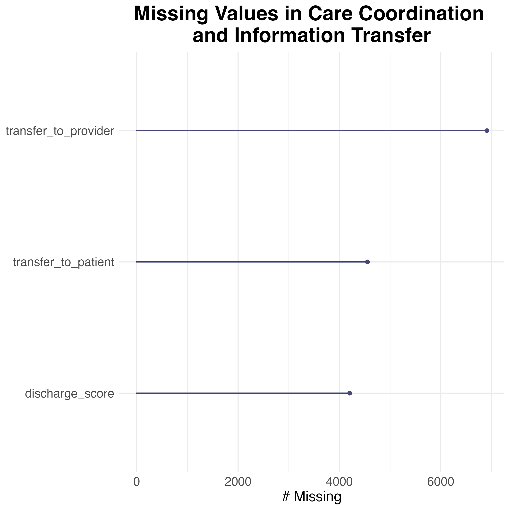
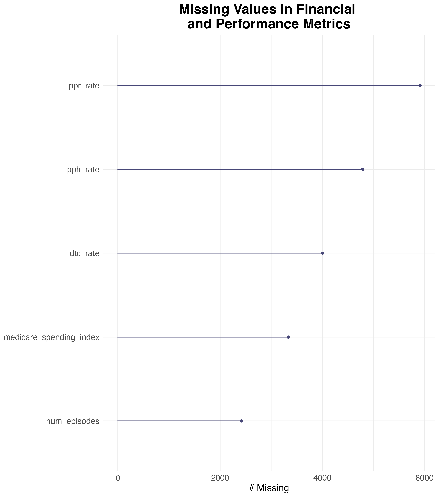
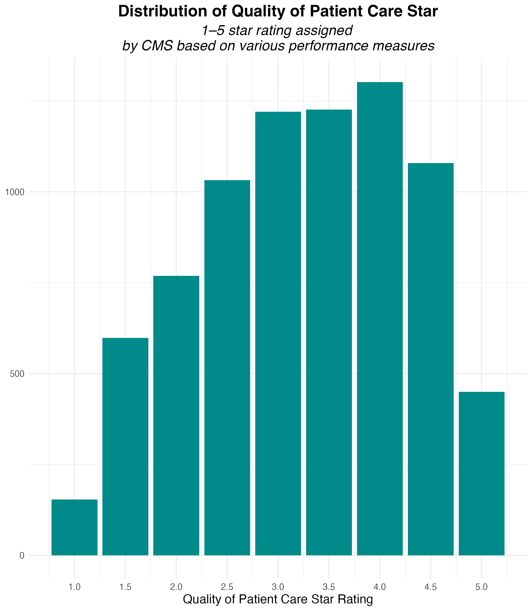
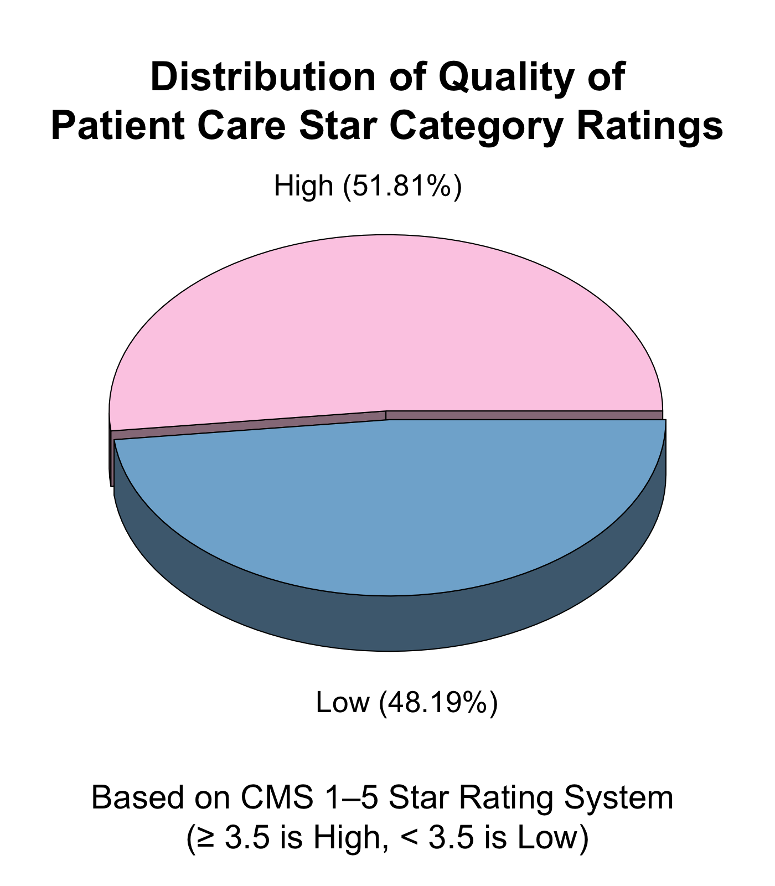
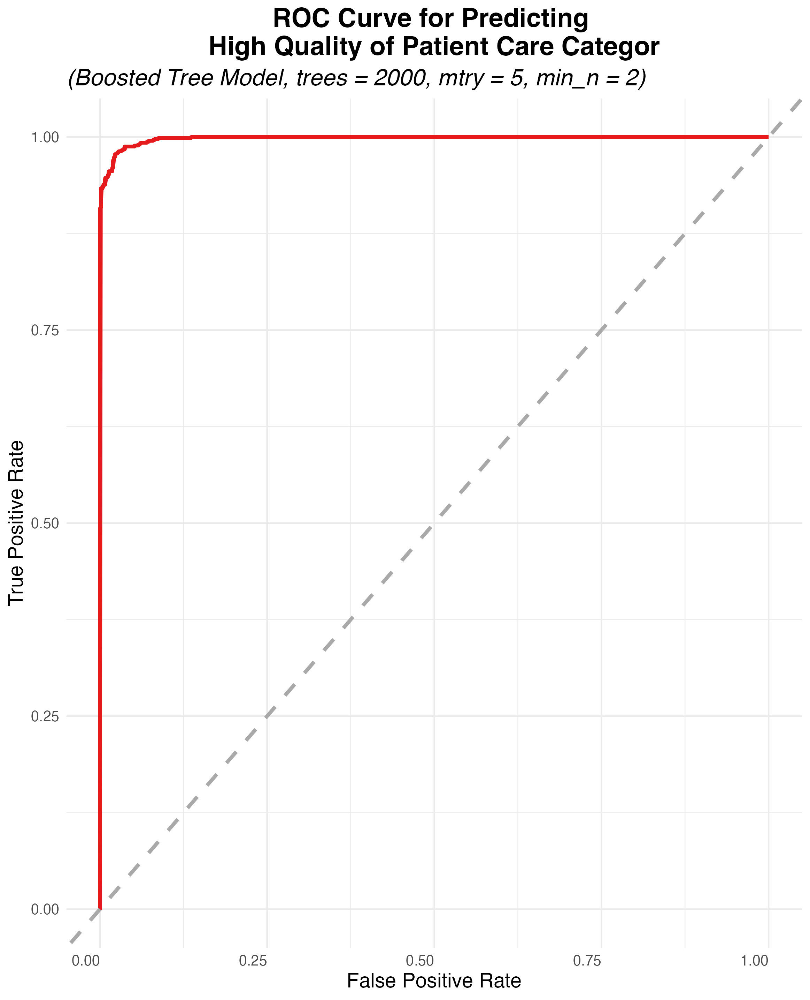

::: {.callout-tip icon=false}

## Github Repo Link
[Tran Chau's Github Repo for Final Project](https://github.com/bunmam-ctrl/stat301-winter-final.git)

:::

## Introduction
### A. Motivation 

In December 2023, seven-year-old Deonte Atwell from Florida, a child requiring round-the-clock skilled nursing care due to severe medical conditions, died from extreme malnutrition. Despite having the necessary medical supplies, including 264 unopened bottles of feeding formula, he was neglected by both his family and home health caregivers. This tragic case highlights a critical failure in home healthcare oversight, leading to multiple criminal charges, including felony murder and Medicaid fraud, against those responsible [@PEOPLE].

This devastating incident underscores the need for a classification-based supervised predictive model to assess home healthcare quality. The goal of this project is to develop a model that predicts the `Quality of Patient Care Star Category` (**high** or **low**) for home health agencies. By analyzing key indicators such as patient outcomes, service effectiveness, and compliance with medical guidelines, this model will provide an evidence-based approach to identifying high- and low-performing agencies. The insights gained can help families make informed decisions about care providers, ensure vulnerable patients receive high-quality care, and support policymakers in enforcing healthcare standards.

### B. Data Source

The predictive model is built using the [Home Health Care Agencies Dataset](https://data.cms.gov/provider-data/dataset/6jpm-sxkc#data-table) from the **Centers for Medicare & Medicaid Services (CMS) Provider Data Catalog** [@DATA]. This dataset includes a comprehensive list of Medicare-registered home health agencies and provides detailed information on agency services, quality measures, patient outcomes, and financial performance.

#### Targer Variable

- **Quality of Patient Care Star Category** (`quality_star_category`)
  - Binary classification: **High or Low**, derived from the original **1–5 star** Quality of Patient Care Star Rating (`quality_star_rating`) assigned by CMS based on various performance measures)


#### Predictor Variables 
##### 1. Agency and Service Characteristics

- **Type of Ownership** (`ownership_type`)
  - For-profit
  - Nonprofit
  - Government-owned

- **Availability of Key Services** (Yes/No):
  - Nursing Care (`nursing_services`)
  - Physical Therapy (`physical_therapy`)
  - Occupational Therapy (`occupational_therapy`)
  - Speech Pathology (`speech_pathology`)
  - Medical Social Services (`medical_social`)
  - Home Health Aide Services (`home_aide`)
  
##### 2. Timeliness and Care Delivery Measures

- **Timely care initiation** (`timely_care`)
  - % of patients whose care began on time
- **Flu shot check** (`flu_shot_check`)
  - % of patients assessed for flu vaccination

##### 3. Patient Improvement and Functional Outcomes

- **Improvement in mobility and self-care** (%):
    - Walking or moving around (`improve_walking`)
    - Getting in and out of bed (`improve_bed_transfer`)
    - Bathing (`improve_bathing`)
    - Breathing (`improve_breathing`)
    - Taking medication correctly (`improve_medicine`)
    - Skin integrity changes (Pressure ulcers/injuries) (`improve_skin`)

##### 4. Medication Safety and Safety Compliance

- **Timely medication actions** (`med_issue_resolved`)
  - % of physician-recommended actions completed on time
- **Major injury falls** (`fall_injury_rate`)
  - % of residents experiencing one or more falls with major injury


##### 5. Care Coordination and Information Transfer

- **Discharge Function Score** (`discharge_score`)
  - Functional improvement at discharge

- **Health information transfer** (%):
  - To provider (`transfer_to_provider`)
  - To patient (`transfer_to_patient`)
  
##### 6. Financial and Performance Metrics

- **Discharge to Community (DTC) rate** (`dtc_rate`)
  - % of patients discharged to the community)
- **Potentially Preventable Hospitalization (PPH) rate** (`pph_rate`)
  - % of patients hospitalized for preventable conditions
- **Potentially Preventable Readmissions (PPR) rate** (`ppr_rate`)
  - % of patients readmitted for preventable reasons
- **Medicare spending per episode** (`medicare_spending_index`)
  - Cost index relative to the national average
- **Medicare episode count** (`num_episodes`)
  - Number of episodes used for cost calculation

### C. Application of the Model 

This **predictive model** evaluates the relationship between agency characteristics, patient outcomes, quality measures, and financial performance to classify home health agencies as either high or low quality. By leveraging **machine learning classification techniques**, this project provides valuable insights for multiple stakeholders. For patients and families, it serves as a decision-making tool to identify high-quality home health agencies, ensuring better care outcomes. **Healthcare providers** can use the model to pinpoint areas for improvement, enhancing patient care and regulatory compliance. Additionally, **policymakers and regulators** can utilize the data-driven insights to monitor home health agencies, enforce quality standards, and promote accountability in the industry. Ultimately, this project aims to increase transparency, drive quality improvements, and prevent failures that could lead to tragic consequences in home healthcare.

## Data Overview

The [Home Health Care Agencies Dataset](https://data.cms.gov/provider-data/dataset/6jpm-sxkc#data-table) consists of **12,015 observations** and **35 variables**, providing a comprehensive view of various agency characteristics, patient care measures, and performance metrics. As detailed in @tbl-hhs-summary, these **35 variables** include **20 numerical variables** and **8 categorical variables**, each capturing different aspects of home health care service quality. However, a critical concern is the presence of missing data, with **94,765 missing values** across the dataset. This constitutes approximately **23%** of the total dataset, indicating a substantial degree of incomplete information that may influence any subsequent analysis.


```{r}
#| label: tbl-hhs-summary
#| tbl-cap: "Summary Statistics of the Home Health Care Agencies Dataset."

load("predictor_check/hhs_summary.rda")
knitr::kable(hhs_summary)
```

One of the most pressing concerns revealed in @tbl-hhs-summary the extent of missingness in both predictor and response variables. If these missing values follow a systematic pattern—such as being more prevalent in lower-performing agencies or certain types of care measures—this could introduce biases that affect interpretations of agency quality and performance. Understanding where these missing values occur and their potential impact on the dataset is crucial before proceeding with further analysis.

### A.Predictor Variables 
#### 1. Agency and Service Characteristics

{#fig-na-agency}

A key challenge in the Home Health Care Agencies Dataset is the presence of missing values in **agency and service-related predictors**, which may affect the classification of agencies and their reported service offerings.  @fig-na-agency highlights notable gaps in critical variables such as `ownership_type` **(~1,700 missing values)**, `nursing_services` **(~1,700 missing)**, and `home_aide` **(~1,700 missing)**. These variables are essential in distinguishing different types of agencies and the scope of care they provide. Agencies failing to report their service offerings might incorrectly appear to offer fewer services, potentially leading to a misrepresentation of their actual capabilities. This misclassification could distort comparisons between agencies and bias quality assessments, particularly if agencies with missing values disproportionately belong to a specific type, such as privately owned or nonprofit organizations.

#### 2. Timeliness and Care Delivery Measures

{#fig-na-timely}

**Timeliness of care**, a crucial factor in evaluating agency responsiveness and patient outcomes, also suffers from high rates of missingness.  @fig-na-timely illustrates that `timely_care` **(~3,500 missing values)** has one of the highest rates of missingness in the dataset. Given that timely care initiation is closely linked to lower hospital readmission rates, agencies with missing values in this variable may appear more efficient than they actually are. Similarly, `flu_shot_check` **(~3,800 missing values)** exhibits even greater missingness. Although this variable does not directly measure quality of care, it serves as an important proxy for preventive health measures and patient safety. The absence of this data could limit the model’s ability to incorporate preventive care factors, which are essential in reducing hospitalizations among high-risk patients.

#### 3. Patient Improvements and Functional Outcomes

{#fig-na-improve}

Another important category affected by missing values is **patient improvement and functional outcomes**. @fig-na-improve highlights substantial missingness in key recovery measures, including `improve_walking` **(~4,100 missing values)**, `improve_bathing` **(~4,100 missing)**, and `improve_bed_transfer` **(~4,200 missing)**. These metrics are critical in assessing whether home health agencies are effectively helping patients regain mobility and independence. Among all patient improvement measures, `skin_integrity` **(~4,000 missing values)** has the highest rate of missingness. Given that skin integrity issues, such as pressure ulcers, are significant post-acute care complications, the absence of this data could hinder the ability to monitor agencies’ effectiveness in preventing serious patient health risks. 

#### 4. Medication and Safety Compliance

{#fig-na-medication}

Missing values are also prevalent in **medication and safety compliance measures**, which are crucial for assessing avoidable risks such as medication errors and patient falls. @fig-na-medication reveals that `fall_injury_rate` **(~3,500 missing values)* ** and `med_issue_resolved` **(~3,500 missing values)** are significantly affected. Falls and medication errors are among the leading causes of preventable hospital readmissions, making these variables especially relevant for evaluating agency safety performance. Missingness in these measures could result in an underreporting of safety risks, allowing some agencies to receive inflated quality ratings that do not accurately reflect their patient safety record. 

#### 5. Care Coordination and Information Transfer

{#fig-na-coordination}

**Care Coordination and Information Transfer**, which are critical for ensuring smooth transitions between healthcare providers and effective patient care management, also contain significant missing values. @fig-na-coordination shows that `transfer_to_provider` **(~6,000 missing values)**, `transfer_to_patient` **(~4,500 missing)**, and `discharge_score` **(~4,000 missing)** are affected. Since proper coordination of care transitions can directly impact patient outcomes and hospital readmission rates, missing data in these variables may limit the dataset’s ability to evaluate how effectively agencies manage care handoffs. Without complete care coordination data, it becomes difficult to assess whether agencies facilitate seamless transitions that ensure continuity and quality of patient care.

#### 6. Financial and Performance metrics

{#fig-na-finance}

**Financial and performance metrics**, which play a crucial role in assessing cost efficiency and operational effectiveness, also contain significant missing values. @fig-na-finance shows that `medicare_spending_index` **(~3,800 missing values)**, `ppr_accuracy` **(~3,100 missing)**, and `dtc_category` **(~2,900 missing**) are among the most affected. Since financial efficiency is an important component of healthcare quality evaluations, missing data in Medicare spending and readmission performance metrics may limit the dataset’s ability to differentiate cost-effective providers from less efficient ones. Without complete financial performance data, it becomes difficult to assess whether agencies are delivering high-quality care at an optimal cost.

### B. Target Variables 

#### 1. Distribution of the Response Variable
`Quality of Patient Care Star Rating` serves as the primary response variable in this dataset, representing the overall performance of home health care agencies based on various assessment criteria. As illustrated in @fig-target-vis, the distribution of ratings is not uniform, with the majority of agencies receiving scores between **2.5 and 4.5 stars**. The lower frequency of 1-star and 5-star ratings suggests that **extreme ratings are relatively rare**, which could be due to the evaluation methodology used in determining agency performance.

{#fig-target-vis}

This pattern indicates that agencies tend to be rated within a moderate range, with very few outliers at the lowest or highest end of the scale. The lack of significant representation in the 1-star and 5-star categories raises questions about whether the rating system naturally avoids extreme scores or if agencies self-select into middle-range ratings through standardized operational practices. Additionally, if agencies with poor performance are less likely to report ratings, this could create a systematic bias in the dataset, leading to an overrepresentation of moderately rated agencies.

#### 2. Missing Data in the Response Variable
A major concern in analyzing the target variable is the substantial proportion of missing values. As shown in @tbl-na-target, **4,185 ratings** are missing, which accounts for **34.83%** of the dataset. The high level of missingness in the response variable is significant because it reduces the available data for analysis, potentially introducing biases in evaluating agency performance.


```{r}
#| label: tbl-na-target
#| echo: false
#| tbl-cap: "Missing values and their percentage in the Quality of Patient Care Star Ratings among home health agencies"

load(here::here("target_check/na_target.rda"))

knitr::kable(na_target)
```

Missing ratings could be systematically associated with certain types of agencies. For example, lower-rated agencies may be more likely to withhold reporting, or smaller agencies with limited resources may not be consistently evaluated. If missing values are not randomly distributed, any predictive modeling effort might be biased toward agencies that are more transparent or perform better in reported metrics.

#### 3. Class Imbalance in the Response Variable and Binary Classification Transformation

A key challenge in predicting `Quality of Patient Care Star Ratings` is class imbalance in the categorical data. As seen in @fig-target-vis, the majority of agencies receive ratings between **3 and 4.5 stars**, while 1-star and 5-star ratings are notably underrepresented. This imbalance can hinder comparative analysis and predictive modeling, as models may favor the majority class and struggle to accurately classify agencies at the extremes. Agencies with very low or very high ratings may be misclassified or underrepresented in model predictions, limiting the ability to assess truly top- or poor-performing agencies.


{#fig-target-vis}

To address this issue, the star rating variable is transformed into **a binary classification problem**, simplifying the prediction task. The new categories are:

- **`High` (≥3.5 stars)**: Agencies rated 3.5 stars or higher are classified as high quality facilities.

- **`Low` (<3.5 stars)**: Agencies rated below 3.5 stars are classified as low quality facilities.

This transformation, as shown in @fig-target-vis, helps mitigate class imbalance while ensuring a more evenly distributed response variable. With **51.81%** of agencies classified as `High` and **48.19%** as `Low`, predictive models can now differentiate between high- and low-performing agencies more effectively. This approach improves model performance by reducing bias toward middle-range ratings, making it easier to detect meaningful differences in agency quality.


## Method 
### A. Data Splitting and Resampling
As highlighted in the previous section^[[**Section B3** of *Data Overview*](file:///Users/bong_banana/Desktop/Stat-301-2/final-project-2-bunmam-ctrl/Tran_Chau_final_report.html#class-imbalance-in-the-response-variable-and-binary-classification-transformation)], the Quality of Patient Care Star Ratings prediction is structured as **a binary classification problem** to enhance model development and evaluation. The target variable, `quality_star_rating`, is transformed into a new categorical variable, `quality_star_category`, with two distinct groups: `High` *(≥ 3.5 stars)* and `Low` *(< 3.5 stars)*. This transformation provides a clearer distinction between high- and low-performing facilities, addressing the challenge of **class imbalance**. In the original rating distribution, most agencies fell between 3 and 4.5 stars, while extreme ratings were underrepresented (@fig-target-vis). By reframing the problem as a binary classification task, predictive models can better differentiate between high- and low-quality agencies, resulting in a more balanced and interpretable target variable.

To ensure robust model training and evaluation, the dataset is split into training and testing sets using an 80/20 ratio. The **training set (80%)** is used for model development and parameter tuning, while the **testing set (20%)** is reserved for final performance evaluation on unseen data. Since class imbalances can influence model learning, **stratified sampling on** `quality_star_category` is applied during the splitting process. This guarantees that the proportions of `High` and `Low` ratings remain consistent in both sets, preventing biases that could arise from an uneven class distribution. By maintaining representativeness across subsets, this approach ensures a fair and balanced dataset, allowing predictive models to learn from both high- and low-performing agencies effectively.

To further enhance model evaluation reliability, **10-fold cross-validation with 5 repeats** is implemented on the training data. In this method, the training set is divided into 10 equal subsets (folds), where **9 folds** are used for **training** and **1 fold** is used for **validation**. This process is **repeated 10 times**, ensuring that each observation is used for validation exactly once. To increase stability and reduce variance in performance estimates, the entire 10-fold process is **repeated 5 times**. This approach helps prevent overfitting and ensures that the model’s predictive accuracy is not dependent on any single training-validation split. Additionally, **stratification** is maintained within the cross-validation folds to ensure that both `High` and `Low` categories remain proportionally balanced throughout training.

| Split type           |         Number of Observations    |    
|:---------------------|----------------------------------:|
| Training Set         |       9,612                       |         
| Testing Set          |       2,403                       |            
| Training per Fold    |       8,651                       |             
| Validation per Fold  |        961                        |        


: Dataset Split Summary for Training and Evaluation {#tbl-split-summary .striped .hover}

### B. Model Training and Hyperparameter Tuning

A diverse set of classification models will be used to compare performance and identify the most effective approach for predicting `quality_star_category`. Each model offers distinct advantages, ranging from interpretability to handling complex, non-linear relationships. Below is an overview of the models considered:

| Model Type          | Description | Tuned Parameters |
|:---------------------|-----------------:|-----------------:|
| Null Model         |  Baseline model that predicts the most frequent class, providing a reference point for evaluation  |    None |
| Logistic Regression | Simple, interpretable model that assumes a linear relationship between features and the response variable        |    None| 
| Elastic Net  |  Regularized logistic regression that applies a penalty to prevent overfitting and improve generalization     |       `mixture` and `penalty`|   
| K-Nearest Neighbors (KNN) | Distance-based model that classifies observations based on their proximity to training examples | `neighbors`   |            
| Random Forest        | Ensemble model that reduces variance by combining multiple decision trees, capturing non-linear patterns         |    `mtry`, `trees`, and `min_n`|  
| Boosted Tree         | Gradient boosting model that iteratively improves weak learners to enhance predictive performance |    `mtry`, `trees`, `min_n`, and `learn_rate` |    

: Overview of Machine Learning Models and Tuned Parameters for Quality Star Prediction {#tbl-model-use .striped .hover}

#### Hyperparameter Tuning Strategy 

To optimize model performance, **hyperparameter tuning** is conducted for select models. Each model has key parameters that influence its learning process, and an appropriate range of values is tested to find the best configuration. The models and their corresponding tuned parameters were previously outlined in @tbl-model-use. Below, we detail the specific ranges and levels tested for each model's hyperparameters.

##### 1. Elastic Net Tuning

Elastic Net applies regularization to prevent overfitting and improve generalization. The following parameters are tuned:

- `mixture`: Controls the balance between different types of regularization, tested in the range 0 to 1, with 10 levels.

- `penalty`: Adjusts the regularization strength, tested in the range $10^{-3}$ to $10^{0}$, with 10 levels.

##### 2. K-Nearest Neighbors (KNN) Tuning
KNN relies on selecting the optimal number of neighbors for classification:

- `neighbors`: Number of nearest neighbors used for classification, tested in the range 1 to 60, with 20 levels.


##### 3. Random Forest Tuning

Random forests require tuning of tree-related parameters for better performance:

- `mtry`: Number of predictors randomly sampled at each split, tested in the range 1 to 33, with 5 levels.

- `trees`: Total number of trees in the forest, tested in the range 500 to 2000, with 4 levels.

- `min_n`: Minimum number of observations required in a node to split, tested in the range 2 to 40, with 4 levels. 

##### 4. Boosted Tree Tuning 

Boosted trees use an iterative learning approach that requires fine-tuning multiple parameters:

- `mtry`: Number of predictors randomly sampled at each split, tested in the range 1 to 5, with 5 levels.

- `trees`: Total number of trees, tested in the range 100 to 2000, with 6 levels.

- `min_n`: Minimum number of observations per node, tested in the range 2 to 40, with 4 levels.

- `learn_rate`: The learning rate, controlling step size in gradient descent, tested in the range $10^{-5}$ to $10^{-0.2}$, with 10 levels.


| Model Type          | Number of models | Total number of trainings^[Number of times a training process must be completed] |
|:---------------------|-----------------:|--------------------------:|
| Null                 |        1          |                50           |
| Logistic model       |        1           |                 50          |
| Elastic net          |        100          |             5,000              |
| K-nearest neighbors  |       20           |         1,000                  |
| Random forest        |     80             |       4,000                    |
| Boosted tree         |     1,200             |       60,000                 |
| **Total**            |      1,402            |      70,100                     |

: Summary of Model Configurations and Total Training Runs {#tbl-mod-totals-class .striped .hover}


By tuning these hyperparameters systematically, each model is optimized for classification accuracy and generalization, ensuring that the best-performing configuration is selected for predicting `quality_star_category`.

### C. Recipe Building 

To ensure proper preprocessing of data for model training, **two main recipes** are implemented: **a basic recipe and a complex recipe**. Each recipe is designed to standardize the dataset by handling missing values, encoding categorical variables, and normalizing numerical features. Furthermore, both the **basic and complex recipes** have **two versions**: one tailored for **regression-based models** and the other optimized for **tree-based models**. Since regression models and tree-based models have different requirements for feature engineering, their preprocessing steps vary accordingly to maximize model performance.

#### 1. Basic Recipe
##### Regression Models

Regression-based models, such as `logistic regression` and `elastic net`, require numerical data with standardized values to ensure stability in optimization. The **basic recipe for regression models** follows these key steps:

**1. Removal of Non-Predictive Variables**

- Features such as `state`, `provider name`, `telephone number`, and `certification details` are removed since they do not contribute to predicting the quality rating and may introduce unnecessary noise.

**2. Filtering Out Zero-Variance Predictors**

- Predictors that have **no variability** across observations are removed, as they do not provide useful information for distinguishing between high- and low-quality agencies.


**3. Handling Missing Data**

As previously discussed^[[**Section A3** of *Data Overview*](file:///Users/bong_banana/Desktop/Stat-301-2/final-project-2-bunmam-ctrl/Tran_Chau_final_report.html#patient-improvements-and-functional-outcomes)], a significant amount of missingness is present in the predictor variables. To address this,

- **Numerical predictors** are imputed using the **mean** to maintain consistency in variable distributions.

- **Categorical variables** are imputed using the **mode**, replacing missing values with the most frequently occurring category in each feature.

**4. Encoding Categorical Variables**

- Categorical predictors are **dummy encoded**, meaning each category is transformed into a separate binary column to ensure compatibility with regression-based models.

**5. Feature Scaling**

- All numerical variables are **normalized** to have a standard scale, improving model convergence and reducing the impact of differing magnitudes across features.

This preprocessing ensures that `logistic regression` and `elastic net` models receive a dataset that is well-prepared for linear classification, reducing biases from scale differences and ensuring all variables are in a comparable format.


##### Tree-Based Models

Tree-based models, including `random forests`, `boosted trees`, and `K-nearest neighbors`, do not require standardized scaling but benefit from a different categorical encoding approach. The **basic tree-based recipe** follows these preprocessing steps:

**1. Removal of Non-Predictive Variables**

- Identical to the regression recipe, **non-informative features** such as provider identifiers and location-based details are excluded to avoid irrelevant influence.

**2. Filtering Out Zero-Variance Predictors**

- Any feature with **zero variance** is removed to prevent unnecessary complexity in tree-based splits.

**3. Handling Missing Data**

Similar to the regression-based models, 

- **Numerical predictors** are imputed using the **mean**, maintaining statistical consistency.

- **Categorical variables** are imputed using the **mode**, replacing missing entries with the most commonly occurring category.

**4. Encoding Categorical Variables**

- Instead of dummy encoding, categorical variables are **one-hot encoded**. This method creates binary indicators for each category **without dropping any levels**, allowing decision trees to use all available information for splitting.

**5. Feature Scaling**

- While tree-based models do not require normalization, numerical variables are still **scaled for consistency**, especially if used in ensemble methods that might incorporate different classifiers.

This approach ensures that `random forests`, `boosted trees`, `K-nearest neighbors` can effectively handle categorical variables while maintaining robustness to un-scaled numeric inputs.

#### 2. Complex Recipe 

To ensure robust modeling and improve predictive performance, a complex recipe is developed for both **regression-based** and **tree-based models**. This recipe builds upon **all preprocessing steps from the basic recipe**, while also incorporating **additional transformation and interaction terms (for regression), aligning with the characteristics of the dataset.

##### Handling Skewed Distributions and Log Transformation

Most healthcare quality indicators are **percentage-based** and exhibit **strong skewness**, making normality transformations ineffective. Metrics such as timely care, physician adherence, and functional improvement are right-skewed, whereas hospital readmission rates and fall injuries tend to have more balanced distributions.

{#fig-finance-dis}

However, according to @fig-finance-dis, `num_episodes` is a notable exception, exhibiting **extreme right-skewness**. This distribution can distort linear modeling assumptions and affect predictive stability. To correct this, a **log10 transformation** is applied in both regression and tree-based models, reducing skewness and enhancing interpretability.^[The impact of this transformation and the distributions of other predictor variables are further analyzed in [**Section A** of *Tran_Chau_appendix*.](file:///Users/bong_banana/Desktop/Stat-301-2/final-project-2-bunmam-ctrl/Tran_Chau_appendix.html#a.-distribution-analysis-of-key-healthcare-metric)]

##### Incorporating Interaction Terms for Regression Models

For **regression-based models**, explicit interaction terms are added to capture relationships between predictors that show significant dependencies. These interactions are identified using **scatterplots**, where predictor-outcome relationships are assessed separately for **high- and low-quality agencies**.

- `Parallel trend lines` (High vs. Low level) → **No interaction**

- `Non-parallel trend lines` (High vs. Low level) → **Significant interaction**

From this analysis, interaction terms are determined based on @tbl-interaction, summarizing significant interactions between predictors and outcomes.^[The scatterplots from the interaction analysis is further examined in [**Section B** of *Tran_Chau_appendix*.](file:///Users/bong_banana/Desktop/Stat-301-2/final-project-2-bunmam-ctrl/Tran_Chau_appendix.html#b.-interaction-effect-of-predictor-variables)]

| Predictor Variable            | `timely_care` | `flu_shot_check` | `improve_walking` | `improve_bed_transfer` | `improve_bathing` | `improve_breathing` | `improve_medicine` | `improve_skin` | `med_issue_resolved` | `fall_injury_rate` | `discharge_score` | `transfer_to_provider` | `transfer_to_patient` | `dtc_rate` | `ppr_rate` | `pph_rate` | `medicare_spending_index` | `num_episodes`|
|:------------------------------|:--------------:|:--------------:|:--------------:|:--------------------:|:---------------:|:----------------:|:---------------:|:---------------:|:-----------------:|:--------------:|:---------------:|:------------------:|:-----------------:|:------:|:--------:|:--------:|:----------------------:|:------------:|
| `timely_care`               |  -            | ✓              | ✓              | ✓                    | ✓               | ✓                | ✓               |                 |                   |                | ✓               |                    |                   |        | ✓        | ✓        |                        |              |
| `flu_shot_check`           |                | -              |                | ✓                    |                 | ✓                | ✓               |                 | ✓                 |                |                 | ✓                  | ✓                 | ✓      |          |          |                        |              |
| `improve_walking`           | ✓              |                | -              | ✓                    | ✓               | ✓                | ✓               |                 |                   |                | ✓               | ✓                  | ✓                 | ✓      | ✓        | ✓        |                        | ✓            |
| `improve_bed_transfer`     | ✓              | ✓              | ✓              | -                    | ✓               | ✓                |                 |                 |                   |                | ✓               |                    | ✓                 |        | ✓        | ✓        | ✓                      |              |
| `improve_bathing`           | ✓              |                | ✓              | ✓                    | -               | ✓                | ✓               |                 |                   |                | ✓               | ✓                  | ✓                 |        | ✓        | ✓        |                        | ✓            |
| `improve_breathing`        | ✓              | ✓              | ✓              | ✓                    | ✓               | -                |                 |                 |                   |                | ✓               | ✓                  | ✓                 | ✓      |          | ✓        |                        | ✓            |
| `improve_medicine`          | ✓              | ✓              | ✓              |                      | ✓               |                  | -               |                 |                   |                | ✓               | ✓                  | ✓                 |        | ✓        |          |                        |              |
| `improve_skin`             |                |                |                |                      |                 |                  |                 | -               | ✓                 |                | ✓               | ✓                  |                   |        | ✓        |          |                        | ✓            |
| `med_issue_resolved`      |                | ✓              |                |                      |                 |                  |                 | ✓               | -                 |                | ✓               |                    |                   |        |          |          |                        |              |
| `fall_injury_rate`         |                |                |                |                      |                 |                  |                 |                 |                   | -              |                 |                    | ✓                 | ✓      |          |          |                        |              |
| `discharge_score`           | ✓              |                | ✓              | ✓                    | ✓               | ✓                | ✓               | ✓               | ✓                 |                | -               |                    | ✓                 | ✓      | ✓        | ✓        | ✓                      | ✓            |
| `transfer_to_provider`      |                | ✓              | ✓              |                      | ✓               | ✓                | ✓               | ✓               |                   |                |                 | -                  |                   |        |          |          |                        | ✓            |
| `transfer_to_patient`     |                | ✓              | ✓              | ✓                    | ✓               | ✓                | ✓               |                 |                   | ✓              | ✓               |                    | -                 |        |          |          |                        | ✓            |
| `dtc_rate`                 |                | ✓              | ✓              |                      | ✓               | ✓                |                 |                 |                   | ✓              | ✓               |                    |                   | -      |          |          |                        | ✓            |
| `ppr_rate`                 | ✓              |                | ✓              | ✓                    | ✓               |                  | ✓               | ✓               |                   |                | ✓               |                    |                   |        | -        |          | ✓                      | ✓            |
| `pph_rate`                 | ✓              |                | ✓              | ✓                    | ✓               | ✓                |                 |                 |                   |                | ✓               |                    |                   |        |          | -        |                        |              |
| `medicare_spending_index`   |                |                | ✓              | ✓                    |                 |                  |                 |                 |                   |                | ✓               |                    |                   |        | ✓        |          | -                      | ✓            |
| `num_episodes`             |                |                | ✓              |                      | ✓               | ✓                |                 | ✓               |                   |                | ✓               | ✓                  | ✓                 | ✓      | ✓        |          | ✓                      | -            |

: Interaction Effects Between Predictors and Outcome Variables {#tbl-interaction .striped .hover}


### D. Model Evaluation Metrics and Selection Criteria

Two key metrics—`accuracy` and `ROC-AUC` (Receiver Operating Characteristic - Area Under the Curve)—are used to compare and select the final predictive model. However, **`ROC-AUC` is prioritized** because it measures the model’s ability to distinguish between high- and low-quality agencies across different classification thresholds, making it more robust to class imbalance. Since the dataset has been transformed to achieve a more balanced distribution, `ROC-AUC` ensures s**trong discriminative ability**, while `accuracy` serves as a complementary measure of overall correctness.

#### 1. `Accuracy`

Accuracy measures the proportion of correctly classified cases and serves as a fundamental metric for evaluating overall model performance. With the dataset now balanced^[[**Section B3** of *Data Overview*](file:///Users/bong_banana/Desktop/Stat-301-2/final-project-2-bunmam-ctrl/Tran_Chau_final_report.html#class-imbalance-in-the-response-variable-and-binary-classification-transformation)], accuracy becomes a reliable indicator of how well the model correctly classifies both high- and low-rated agencies without bias toward the majority class.

#### 2. `ROC-AUC` 

ROC-AUC assesses how well the model differentiates between high- and low-quality agencies across various probability thresholds. A high ROC-AUC score indicates strong predictive discrimination, ensuring that the model effectively ranks agencies by their quality classification, even when decision thresholds change. This metric is particularly useful for assessing model robustness in **real-world decision-making**, where thresholds may vary.


By selecting accuracy and ROC-AUC—given the dataset’s balanced distribution—the final model is selected based on **its ability to correctly classify agencies (accuracy) and effectively separate classes under varying thresholds (ROC-AUC),** ensuring strong *predictive reliability* across different settings. 


## Model Building

To determine the best predictive model, we systematically compared multiple classification models, prioritizing `ROC-AUC` as the primary evaluation metrics. Given that the dataset has been transformed to achieve a more balanced distribution between high- and low-quality agencies^[[**Section B3** of *Data Overview*](file:///Users/bong_banana/Desktop/Stat-301-2/final-project-2-bunmam-ctrl/Tran_Chau_final_report.html#class-imbalance-in-the-response-variable-and-binary-classification-transformation)], these metrics provide a comprehensive assessment of predictive performance.

- `Accuracy` measures the proportion of correctly classified cases, ensuring that the model reliably identifies high- and low-quality agencies without bias.

- `ROC-AUC` evaluates the model’s ability to separate high- and low-quality agencies across different classification thresholds, making it crucial for **risk assessment scenarios where misclassification can have significant implications**.

### A. Model Performance Comparison 

The performance comparison across different model types in @tbl-roc-basic and @tbl-roc-complex underscores the necessity of more complex models, particularly tree-based methods, in improving predictive performance. The `null model`, which assumes no meaningful relationship between predictors and outcomes, yielded an `accuracy` of **0.518** and an `ROC-AUC` of **0.500** in both the basic and complex recipes. This result establishes a critical baseline, demonstrating that any model achieving higher accuracy and ROC-AUC provides substantive predictive value beyond random guessing. 

{#tbl-roc-basic}

Among the tested models, ***tree-based methods*** (`random fores`t and `boosted trees`) consistently outperformed ***regression-based approaches*** (`logistic regression` and `elastic net`). The **boosted tree model** emerged as the top performer, with an `accuracy` of **0.979** and an `ROC-AUC` of **0.998** under the complex recipe (@tbl-roc-basic and @tbl-roc-complex). This result highlights the model's ability to capture nonlinear relationships and complex feature interactions, key advantages of gradient boosting. The `random forest model` also performed well, achieving an accuracy of **0.961** and an ROC-AUC of **0.995**, making it a strong alternative. 

{#tbl-roc-complex}

In contrast, `logistic regression` and `elastic net` models demonstrated slightly lower performance, despite their interpretability advantages. Both models achieved an accuracy of approximately **0.950** with an ROC-AUC of **0.990** or lower (@tbl-roc-basic and @tbl-roc-complex), indicating their limitations in capturing intricate dependencies in the data. Notably, `KNN` underperformed relative to tree-based models, achieving an accuracy of **0.894** and an ROC-AUC of **0.968**, suggesting that its reliance on distance-based similarity was less effective in this context (@tbl-roc-complex).

### B. Recipe Selection 

While the introduction of ***complex recipes*** did not drastically improve predictive power, they refined the tuning process, particularly for tree-based models, leading to greater stability and generalization. This refinement is evident in the reduced standard errors observed in the `boosted tree` model. In the ***basic recipe***, the `boosted tree` achieved an `accuracy` of **0.978** with a `standard error` of $6.70 × 10^{-4}$, and an `ROC-AUC` of **0.998** with a `standard error` of $9.11 × 10^{-5}$ (@tbl-roc-basic). When incorporating the ***complex recipe***, these values remained highly stable, with an `accuracy` of **0.979** and a `standard error` of $6.09 × 10^{-4}$, while the `ROC-AUC` remained at **0.998** with lower standard error of $8.96 × 10^{-5}$ (@tbl-roc-complex).  

Similarly, the `random forest model` exhibited only marginal improvements with the complex recipe. In the ***basic recipe***, it achieved an `accuracy` of **0.960** with a `standard error` of $1.01 × 10^{-3}$, and an `ROC-AUC` of **0.995** with a `standard error` of $2.06 × 10^{-4}$ (@tbl-roc-basic). In contrast, the ***complex recipe*** resulted in an `accuracy` of **0.961** with a lower `standard error` of $9.57 × ^{-4}$, and an `ROC-AUC` of **0.995** with a reduced `standard error` of $1.97 × 10{-4}$ (@tbl-roc-complex).

### C. Limitations of Complex Recipes

Despite the introduction of complex recipes, the `logistic regression` and `elastic net` models exhibited mixed performance changes. Specifically, `logistic regression` saw a slight increase in `accuracy` from **0.946 to 0.955**, yet its `ROC-AUC` declined from **0.989 to 0.975** (@tbl-roc-basic and @tbl-roc-complex). Similarly, `elastic net` experienced a small `accuracy` improvement from **0.945 to 0.949**, and its `ROC-AUC` marginally increased from **0.989 to 0.990** (@tbl-roc-basic and @tbl-roc-complex). 

This pattern suggests that while the models became slightly better at making correct overall classifications (**higher accuracy**), they may have lost some ability to distinguish between high- and low-quality agencies across different probability thresholds (**lower** `ROC-AUC` for `logistic regression`). This trade-off indicates that adding interaction terms may have improved decision boundary sharpness, leading to more confident classifications, but at the cost of reducing the model's discriminative ability. The increase in standard errors, particularly for `logistic regression` (from $1.11 × 10^{-3}$ to $2.22 × 10^{-3}$ for `accuracy`, and from $4.24  × 10^{-4}$ to $3.87  × 10^{-3}$ for `ROC-AUC`), further suggests that these transformations introduced more variance into the predictions, making the model less stable and more sensitive to small changes in data (@tbl-roc-basic and @tbl-roc-complex).

This outcome highlights the need for a more refined **feature selection strategy** when incorporating interaction terms, ensuring that added complexity enhances both classification accuracy and ranking ability rather than simply **optimizing one at the expense of the other**.

### D. Best Models

To determine the best-performing model, `ROC-AUC` was prioritized, as discussed earlier. This metric provides insights into the model's ability to distinguish between high- and low-quality agencies. @tbl-roc-basic  and @tbl-roc-complex summarize the model performance across different algorithms, including `logistic regression`, `elastic net`, `KNN`, `random forest`, and `boosted trees`.

The ***boosted tree model with complex recipes*** was identified as the best-performing model, achieving an `accuracy` of **0.979** and, more importantly, an `ROC-AUC` of **0.998** (@tbl-roc-complex). This means:

- `Accuracy` of **0.979**: The model correctly classifies **97.9%** of healthcare agencies into their respective high- or low-quality categories. This level of precision is crucial for decision-making in policy planning, resource allocation, and patient referrals.

- `ROC-AUC` of **0.998**: The model exhibits an almost perfect ability to distinguish between high- and low-quality agencies, ensuring that it minimizes **false positives (misclassifying a low-quality agency as high-quality)** and **false negatives (misclassifying a high-quality agency as low-quality)**. In practical terms, this helps healthcare regulators and stakeholders make better-informed decisions with confidence.

According to @tbl-roc-complex, the **standard error values** for the boosted tree model—$6.09 × 10^{-4}$ for `accuracy` and $8.96 × 10^{-5}$ for `ROC-AUC`—indicate an exceptionally stable and reliable predictive performance. In the context of healthcare quality assessment, this means that the model’s classification of high- and low-quality agencies remains highly consistent across different data samples. A small standard error suggests that even with slight variations in the dataset, the model’s `accuracy` **(97.9%)** and ability to distinguish between agency quality levels (`ROC-AUC` = **0.998**) would not fluctuate significantly.

The selection of the boosted tree as the best model is not surprising, given its well-documented ability to capture complex, nonlinear relationships. The model's high performance is driven by its large number of `trees` **(2,000)** and optimized hyperparameters, including `mtry`, `min_n`, and `learn_rate` according to @tbl-model-tune.


### E. Model Tuning & Future Considerations

For the boosted tree model, the best-performing hyperparameters included **2,000 `trees`, `mtry` = 5, `min_n` = 2, and `a learning rate` of 0.0541**, as shown in @tbl-model-tune. These values provided the optimal balance between model complexity and predictive accuracy, ensuring robust performance in distinguishing high- and low-quality agencies.

However, future tuning efforts should consider **expanding the upper boundary** for both `trees` and `mtry` beyond their current limits (2,000 and 5, respectively), as additional flexibility in these parameters may further enhance stability and accuracy. In the current tuning setup, the maximum number of `trees` was capped at **2,000**, and `mtry` was limited to **5**, which served as the upper boundaries during tuning^[[**Section Hyperparameter Tuning Strategy** of *Method*](file:///Users/bong_banana/Desktop/Stat-301-2/final-project-2-bunmam-ctrl/Tran_Chau_final_report.html#hyperparameter-tuning-strategy)]. While these settings optimized model performance, increasing the search space could reveal potential marginal gains in predictive power. A higher `tree` count may help further reduce variance and improve generalization, while an expanded `mtry` could capture more complex feature interactions by selecting a larger subset of predictors at each split. Given that boosting iteratively refines predictions, future studies should explore higher values for `trees` and `mtry` to determine if further optimization leads to improved predictive reliability without excessive computational costs.


| Model Type          | Basic Recipes | Complex Recipes  | Tuning Range  |
|:---------------------|-----------------:|-----------------:|----------------:|
| Null Model         |   None |    None | None | 
| Logistic Regression | None       |    None|  None |
| Elastic Net  | `mixture` = 0.00464 <br> `penalty` = 0.889 |`mixture` = 0.111 <br> `penalty` = 0.001    | ` mixture` = [0,1]  <br> `penalty` = [$10^{-3}$, 1]|
| K-Nearest Neighbors (KNN) |`neighbors` = 44 | `neighbors`  = 38 | `neighbors` = c(1,60)|      
| Random Forest        |    `mtry` = 9 <br> `trees` = 1,500 <br>  `min_n` = 2   | `mtry` = 9 <br> `trees` = 2,000 <br> `min_n` = 2| `mtry` = [1,33] <br> `trees` = [500,2000]  <br> `min_n` = [2,40] | 
| Boosted Tree       |    `mtry` = 5 <br> `trees` = 2,000 <br>  `min_n` = 2  <br>  `learn_rate` = 0.0541 |  `mtry` = 5 <br> `trees` = 2,000 <br> `min_n` = 2 <br>  `learn_rate` = 0.0541 | `mtry` = [1,5] <br> `trees` = [100,2000] <br> `min_n` = [2,40] <br>`learn_rate` = [$10^{-5}$, $10^{-0.2}$]|

: Best-performing hyperparameters for each model type, selected based on ROC-AUC optimization. The table presents both basic and complex recipe configurations, with hyperparameters tuned to enhance predictive performance. {#tbl-model-tune .striped .hover}

Yet, since the model already achieved a **very high accuracy (0.979) and ROC-AUC (0.998)**, and given that tuning boosted models is computationally intensive and time-consuming, further expansion of these parameters was not pursued in this study. This decision balances the trade-off between additional tuning efforts and the already strong predictive performance, ensuring efficient model selection without unnecessary computational overhead.

Additionally, the optimal hyperparameters for other models, such as `elastic net`, `random forest`, and `KNN`, remained within the expected tuning ranges, further supporting the robustness of the selected parameter values according to @tbl-model-tune. These models performed well within their respective configurations, but **none surpassed the predictive power and stability of the boosted tree model**, reinforcing its selection as the final model.^[For more analysis on tuning process, refer to [**Section C** of *Tran_Chau_appendix.html*](file:///Users/bong_banana/Desktop/Stat-301-2/final-project-2-bunmam-ctrl/Tran_Chau_appendix.html#c.-tuning-parameter-analysis)]


## Final Model Analysis

The final ***boosted tree model*** was applied to the testing dataset to evaluate its ability to distinguish between high- and low-quality healthcare agencies. The primary performance metrics, `accuracy` and `ROC-AUC`, confirm the model’s strong predictive reliability. As shown in @tbl-final-metrics, the model achieved an `accuracy` of **0.976**, meaning that it correctly classified nearly **97.6%** of agencies in the testing dataset. The `ROC-AUC` of **0.998** further indicates that the model excels in differentiating high-quality agencies from low-quality ones across various decision thresholds. In the context of healthcare quality assessment, a high `ROC-AUC` signifies that the model **provides consistent and confident predictions**, reducing the likelihood of agencies being misclassified due to uncertainty in probability scores.


```{r}
#| label: tbl-final-metrics
#| tbl-cap: "Performance metrics of the final boosted tree model, evaluated using Accuracy and ROC-AUC"

load(here::here("final_fitting/hhs_final_metrics.rda"))
knitr::kable(hhs_final_metrics, digits = 3)
```


### A. Agreement Between Predictions and Actual Classifications

#### 1. Confusion Matrix

{#fig-conf-mat}

To further assess the model’s effectiveness, @fig-conf-mat provides insight into how well the predicted classifications align with actual quality ratings. The model correctly identified **792 out of 809 high-quality agencies** and **738 out of 758 low-quality agencies**, reflecting its strong ability to capture the underlying patterns in the data. However, **17 low-quality agencies** were misclassified as high-quality, and **20 high-quality agencies** were misclassified as low-quality. These misclassifications may indicate borderline cases where agency quality scores are near the threshold between high and low classifications.


#### 2. ROC Curve

{#fig-roc-auc}

@fig-roc-auc exhibits a sharp rise near the origin, closely hugging the upper-left corner before plateauing at the top, indicating exceptional model performance. This shape suggests that the model consistently assigns **higher probability scores** to high-quality agencies while maintaining a minimal false positive rate. Even in ambiguous cases where agency quality is borderline, the model effectively differentiates between high- and low-quality categories. 

This characteristic is particularly valuable in healthcare policy settings, where decision-makers rely on predictive models to prioritize interventions for lower-performing agencies while ensuring that high-performing agencies are appropriately recognized. The steep incline of the curve reflects that the model quickly achieves a high true positive rate with minimal misclassification, making it a robust and reliable tool for risk stratification and resource allocation in healthcare quality assessment.


### B. Why the Boosted Tree Model Was the Best Choice

#### 1. Boosted Tree vs. Other Models

A critical factor in assessing the effectiveness of the predictive model is determining whether its added complexity is justified compared to baseline models. The `null model`, which essentially assigns random classifications, exhibited an `ROC-AUC` of **0.500**, indicating no predictive power—equivalent to flipping a coin (@tbl-roc-complex). Traditional regression-based models, such as `logistic regression` and `elastic net`, demonstrated moderate performance but struggled with capturing nonlinear interactions within healthcare quality indicators. As observed in @tbl-roc-complex, the `boosted tree` model significantly outperformed all other approaches, demonstrating its ability to effectively distinguish between high- and low-quality agencies—a crucial capability in healthcare settings where classification errors could impact funding and policy decisions.


#### 2. Key Advantages of the Boosted Tree Model
Several other key characteristics made the `boosted tree` model the optimal choice for this task:

- ***Superior Handling of Nonlinearity***

  - Unlike regression-based models, which assume linear relationships, boosted trees iteratively refine decision boundaries, making them particularly suited for the complex interactions present in healthcare quality assessments. The model’s ability to adaptively learn patterns from the data contributes to its superior performance.

- ***Minimal Misclassification Risks***

  - @fig-conf-mat reveals that while some agencies were misclassified, the overall misclassification rate remains exceptionally low. More importantly, the model’s high probability calibration, as evidenced by its near-perfect ROC curve (@fig-roc-auc), ensures that low-quality agencies are not systematically misclassified as high-quality, reducing the risk of misguided policy decisions.

- ***Generalizability Across Probability Thresholds***

  - The steep incline of the ROC curve (@fig-roc-auc) signifies that the model maintains high discriminative power across different probability cutoffs. This flexibility is crucial for healthcare policymakers, as decision thresholds can be adjusted based on specific funding or intervention needs, ensuring reliable predictions even under varying policy applications.
  
#### 3. Future Considerations
Although the `boosted tree` model required more extensive tuning^[[**Section E** of *Model Building*](file:///Users/bong_banana/Desktop/Stat-301-2/final-project-2-bunmam-ctrl/Tran_Chau_final_report.html#e.-model-tuning-future-considerations)], its performance gain over simpler models justified the added complexity. Given that the `null model` was no better than random guessing, and traditional regression models exhibited weaker predictive power^[[**Section A** of *Model Building*](file:///Users/bong_banana/Desktop/Stat-301-2/final-project-2-bunmam-ctrl/Tran_Chau_final_report.html#a.-model-performance-comparison)], the effort in hyperparameter tuning and model refinement was well worth it. The model’s ability to provide precise, high-confidence classifications underscores the necessity of more sophisticated machine learning techniques in healthcare assessments.

However, future efforts should prioritize improving model interpretability through techniques such as **SHAP (Shapley Additive Explanations)**, which can help decision-makers understand the key factors driving predictions [@DBLP]. Additionally, refining decision thresholds could further reduce misclassification risks, particularly for agencies that fall near the boundary between high and low quality.
  
  
## Conclusion 

The `boosted tree model` emerged as the most effective predictive tool for classifying **high- and low-quality healthcare agencies**, demonstrating superior performance over traditional regression-based approaches. With **high accuracy and near-perfect ROC-AUC**,^[[**Section A** of *Final Model Analysis*](file:///Users/bong_banana/Desktop/Stat-301-2/final-project-2-bunmam-ctrl/Tran_Chau_final_report.html#a.-agreement-between-predictions-and-actual-classifications)] the model exhibited exceptional **discriminative power and robustness**, ensuring reliable classification across varying probability thresholds. Its ability to handle complex, nonlinear interactions between healthcare quality indicators provided a substantial advantage over baseline and simpler models,^[[**Section B1** of *Final Model Analysis*](file:///Users/bong_banana/Desktop/Stat-301-2/final-project-2-bunmam-ctrl/Tran_Chau_final_report.html#boosted-tree-vs.-other-models)] making it a valuable asset for data-driven decision-making in healthcare policy and resource allocation. 


### A. Key Findings and Insights

- **Tree-based models significantly outperformed regression-based approaches**, indicating that healthcare quality metrics involve complex, nonlinear relationships that cannot be fully captured by traditional methods.  

- **The inclusion of complex recipes had a marginal effect on predictive power**, suggesting that future efforts should focus on refining interaction terms rather than broad transformations. 

- **Hyperparameter tuning played a crucial role in model performance**, particularly in optimizing `trees`, `mtry`, and `min_n`. However, expanding the search space for these parameters in future work may yield further refinements.  

- **Model interpretability remains a critical challenge**, as black-box models like boosted trees require additional techniques (e.g., `SHAP`) to explain their decision-making processes.  

### B. Future Research Directions

While this study provided valuable insights into healthcare quality prediction, several areas warrant further exploration to enhance both the practical utility and interpretability of the model.  

1. ***Expanding to Multiclass Classification***

This study framed healthcare quality prediction as a **binary classification problem**, categorizing agencies into `High` and `Low` quality. However, real-world `quality_star_rating` scores range from **1 to 5 stars**, which may provide a more nuanced understanding of agency performance. Future work should explore **multinomial classification models** that predict the full range of star ratings, allowing for more granular differentiation between agency performance levels. This could improve targeted policy decisions by providing richer insights into healthcare quality variations, rather than collapsing multiple performance levels into a binary outcome.

2. ***Expanding Model Interpretability***

The use of `boosted trees` significantly improved predictive accuracy but **diminished the inferential interpretability** of the model. Unlike regression-based approaches, which provide direct insights into the influence of each predictor, tree-based models operate as black boxes, making it challenging to pinpoint which healthcare factors drive classification decisions. This limitation is particularly concerning in policy-driven environments, where knowing why an agency is classified as low-quality is as crucial as the classification itself. To address this, integrating **SHAP and feature importance analyses** will be essential. These techniques can help identify the most influential predictors, enabling healthcare administrators to prioritize interventions in the areas most strongly associated with lower-quality outcomes, ultimately leading to targeted improvements in healthcare services.  

3. ***Refining Feature Engineering*** 

Although the study incorporated interaction terms and transformations, their impact on predictive performance was **marginal in logistic regression**.^[[**Section C** of *Model Building*](file:///Users/bong_banana/Desktop/Stat-301-2/final-project-2-bunmam-ctrl/Tran_Chau_final_report.html#c.-limitations-of-complex-recipes)] This suggests that not all interactions contribute meaningfully to classification and that some may introduce unnecessary complexity without improving performance. Future work should focus on selecting interactions that are empirically supported by healthcare research, rather than applying broad transformations. Additionally, alternative feature selection methods could be explored to retain only the most relevant predictors, ensuring that the model remains both interpretable and computationally efficient.  

4. ***Threshold Optimization***

While `accuracy` and `ROC-AUC` were used to evaluate model performance, classification decisions in real-world applications rely on probability threshold to distinguish between high- and low-quality agencies. In this study, a standard cutoff was used, but **different thresholds may be more appropriate depending on policy objectives**. Future research should explore dynamic threshold adjustments based on specific policy and funding constraints, potentially using cost-sensitive learning approaches to optimize classification decisions based on the real-world consequences of false positives and false negatives.  

By addressing these areas, the predictive model can be further refined not only to improve its accuracy but also to enhance its practical usability in healthcare decision-making.

## Used of Generative AI

I used **ChatGPT** to improve sentence flow, check grammar, and make my writing more concise. Additionally, I used it to identify and correct errors in my code, including debugging typos and deciphering error messages. ChatGPT also helped me format @tbl-roc-basic and @tbl-roc-complex, particularly along side with the [Functions for Tabular Reporting](https://ardata-fr.github.io/flextable-book/index.html#introduction) document for table formatting in R [@TABLE, chap. 7].

## References

::: {#refs}
:::
